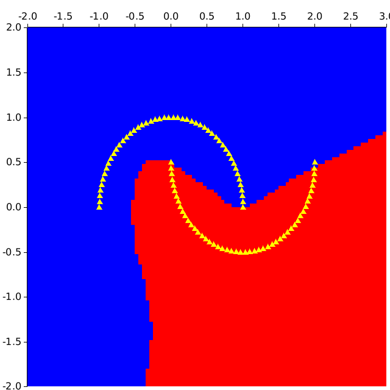

# Description

A toy example of a tiny Autograd engine inspired by https://github.com/karpathy/micrograd

Implements backpropagation (reverse-mode autodiff) over a dynamically built DAG and a small neural networks library
on top of it with a PyTorch-like API.

# Details

* almost zero dependencies (only `rand` crate to initialize weights with uniform distribution)
* use Rc<RefCell<>> to share mutable state (gradients and weights)

# Usage

The full example see here: [examples/moons.rs](examples/moons.rs). Some key aspects:

Create model and test data:

```rust
    // create model
    let mut model = mikrograd::new_mlp(2, &[16, 16, 1]);

    // generate test data
    let (x_data, y_labels) = make_moons(n_samples);
```

Define loss function:
```rust
fn loss(x_data: &Array<f64, Ix2>, y_labels: &Array<f64, Ix1>, model: &MLP) -> (Value, f64) {
    let inputs = x_data.map_axis(Axis(1), |data| data.mapv(mikrograd::new_value));

    // forward the model to get scores
    let scores = inputs.mapv(|input| model.call(input.as_slice().unwrap())[0].clone());

    //svm "max-margin" loss
    let losses = ndarray::Zip::from(y_labels).and(&scores).map_collect(|&yi, scorei| (1. + -yi * scorei).relu());
    let losses_len = losses.len() as f64;
    let data_loss = losses.into_iter().sum::<Value>() / losses_len;

    // L2 regularization
    let alpha = 1E-4;
    let reg_loss = alpha * model.parameters().map(|p| p * p).sum::<Value>();
    let total_loss = data_loss + reg_loss;

    // also get accuracy
    let accuracy =
        ndarray::Zip::from(y_labels).and(&scores).map_collect(|&yi, scorei| (yi > 0.) == (scorei.get_data() > 0.));
    let accuracy = accuracy.fold(0., |acc, &hit| acc + if hit { 1. } else { 0. }) / accuracy.len() as f64;

    return (total_loss, accuracy);
}
```

Run optimization loop:

```rust
    for k in 0..100 {
        // forward
        let (total_loss, accuracy) = loss(&x_data, &y_labels, &model);

        // backward
        model.zero_grad();
        total_loss.backward();

        // update (sgd)
        let learning_rate = 1. - 0.9 * k as f64 / 100.;
        for p in model.parameters_mut() {
            p.set_data(p.get_data() - learning_rate * p.get_grad());
        }

        println!("step {} loss {}, accuracy {:.2}%", k, total_loss.get_data(), accuracy * 100.);
    }
```

"Poor-man's" visualization of decision boundary:

